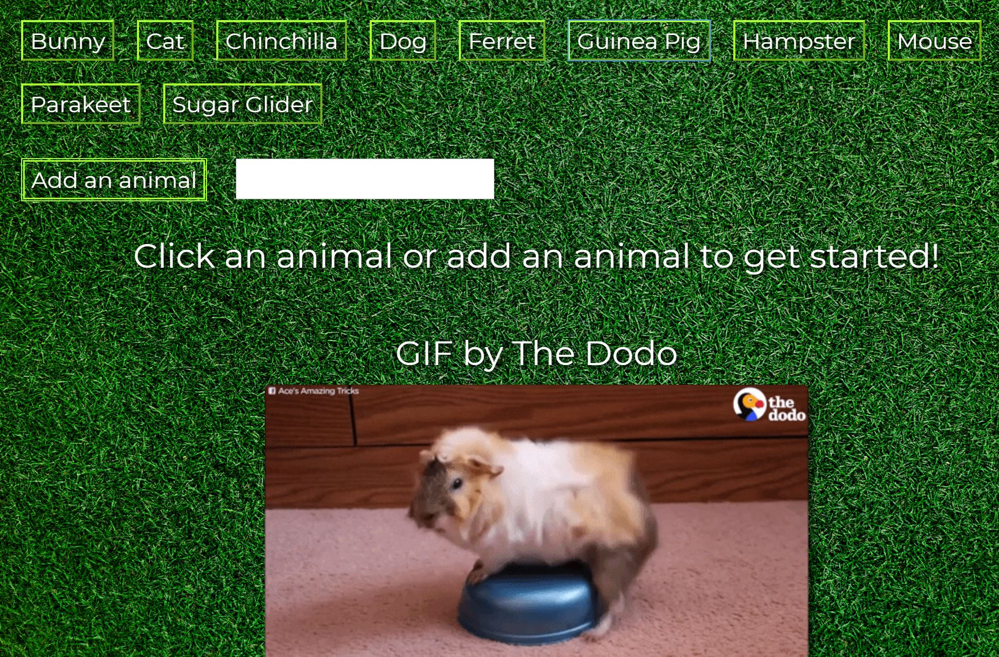

# GIPHY-API
This is a front end application built with jQuery utilizing the giphy API.

# How to use
Either click one of the ten provided animal buttons or enter a new animal button of your choosing.  Once an animal button is clicked, ten still images are returned for that category.  When one of the still images is clicked, the associated gif plays until clicked.

### [Try the App!](https://Edestiny7.github.io/GIPHY-API/)

Technology: HTML5 | CSS3 | JavaScript | jQuery Bootstrap | Google Fonts | API